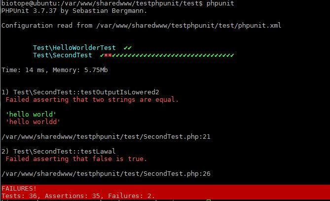

phpunit-printer
======================

A PhpUnit result printer (based on kujira-phpunit-printer)

## Requirements

 * PHP 5.5.0 or later.
 * A symfony installation

## How it looks



## Installation

composer require --dev "agotfrid/phpunit-printer"

## Configuration

* Add to your phpunit.xml

```xml
    <phpunit
        bootstrap="config/bootstrap.php"
        colors="true"
        printerFile="vendor/agotfrid/phpunit-printer/src/Printer.php"
        printerClass="agotfrid\PHPUnit\Printer"
    >
```

* Configure your php.ini default_charset to UTF-8
* Configure your terminal to display UTF-8 charset and use a UTF-8 compatible font like DejaVu Sans Mono

## License

The Kujira result printer for PHPUnit is licensed under the [MIT license](LICENSE).
